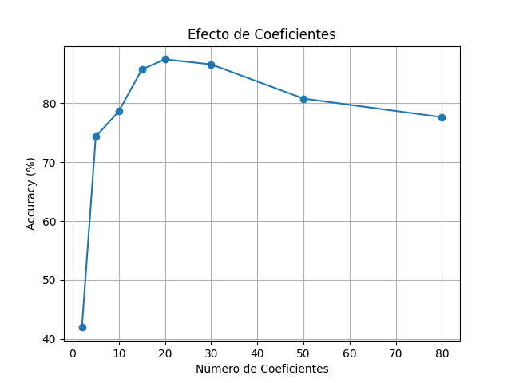
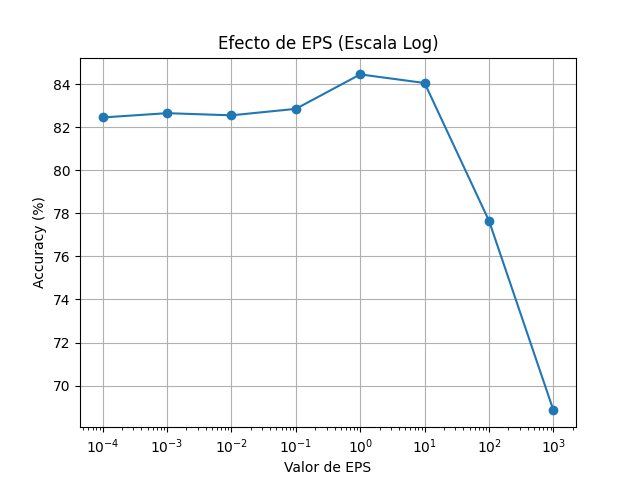
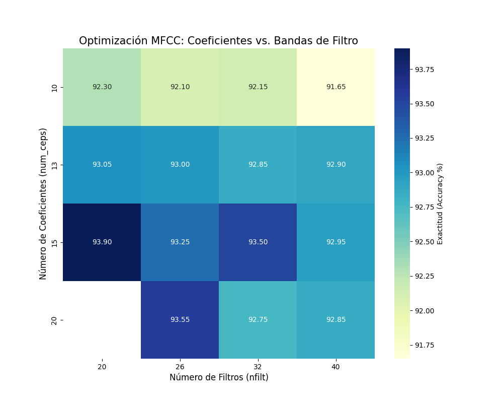
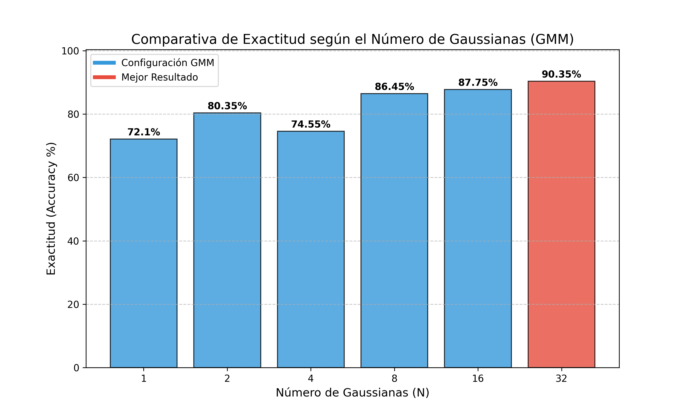

# Ejercicio Final de TecParla

## Introducción

Este proyecto tiene como objetivo la construcción de un sistema de reconocimiento de vocales altamente preciso, integrando técnicas avanzadas de extracción de características y modelado acústico. Se ha optimizado cada componente mediante un análisis de todos los parámetros que le influyen.

## Técnicas de extracción de características

### Estimación espectral con Periodograma y Clasificador Gaussiano

Para poder comparar los distintos sistemas vamos a partir de nuestro sistema anteriormente implementado en clase.

En este utilizó el Periodograma mediante la Transformada Rápida de Fourier (FFT) para obtener la distribución de energía de la señal en el dominio de la frecuencia.

Se empleó la clase Gauss, que asume que las características de cada vocal siguen una distribución gaussiana única y estas quedan definida por un vector de medias y una matriz de covarianzas, clasificando las muestras nuevas mediante la probabilidad de pertenencia a dicha campana.

**Número de Coeficientes:** Se analizó cuántos componentes del espectro eran necesarios para distinguir las vocales. Como se observa en la gráfica datos_coef.png, el rendimiento aumenta hasta los 15 coeficientes, luego se satura y empieza a decrecer.

**Valor de EPS:** Se ajustó el suelo de ruido logarítmico para garantizar la estabilidad numérica de los cálculos. 

### Estimación espectral de Máxima Entropía con LPC

La estimación espectral de máxima entropía se basa en la predicción lineal (LPC). En lugar de usar la FFT directamente, asume que la señal sigue un modelo de filtro.

Aunque en la grafica se observa un pico puntual en p=20, el valor p=14 ofrece un resultado de 84.50%, siendo computacionalmente más ligero y con menos probabilidades de coger el ruido de la señal.

Como las señales están muestreadas a 8000 Hz, la gráfica llega hasta la frecuencia de Nyquist (4000 Hz).El orden $p=14$ es ideal aquí porque permite definir con precisión los 3 o 4 formantes principales que caen en este rango, eliminando las variaciones irrelevantes de la fuente glotal.

Se observa con claridad cómo cada vocal tiene una "huella dactilar" única basada en la posición de sus picos.Por ejemplo, en la vocal **i** se aprecia un primer formante bajo y un segundo formante muy alto , mientras que en la **a** los dos primeros formantes están más juntos y centrados.
Al superponer las cinco curvas, se hace evidente el solapamiento y las diferencias. El clasificador utiliza precisamente estas diferencias en la posición de los picos para decidir qué vocal se está pronunciando.

### Estimación espectral de Máxima Entropía con MFCC

A diferencia del LPC que modela el tracto vocal, los MFCC modelan la audición humana mediante una escala logarítmica de frecuencias (Mel).

Podemos observar que los porcentajes de exactitud son más altos que en el caso anterior. Esto es debido a que LPC trata por igual las diferencias de frecuencia en los graves que en los agudos. En cambio MFCC utiliza la escala Mel, que imita el oído humano, es decir, concentra la resolución donde más importa para distinguir el habla. Lo hace mediante la DCT que transforma los datos a un dominio donde los coeficientes están decorrelacionados. 

La configuración más óptima para escuchar el espectro es usar los primeros 15 coeficientes y 20 filtos.

## Modelado acústico

### Modelado de mezcla de gaussianas

El mezcla de gaussianas permite representar cada vocal como una combinación de varias distribuciones, capturando mejor la variabilidad entre diferentes locutores.

El valor óptimo seria usar **8** gaussianas. Podemos opservar que a partir de 8 va incrementando muy poco a poco y aunque el resultado es un poco mejor necesita más carga computacional para llegar a él.

### Modelado usando redes neuronales

Este sistema a diferencia del anterior, tiene un enfoque discriminativo; no le importa cómo es la vocal por dentro; solo le importa dónde está la frontera que la separa de las demás. Al enfocarse solo en "qué hace que una **a** no sea una **e**" lo mucho más eficiente y preciso.

Analizando la gràfica podemos identificar:

**El impacto crítico de la función de activación:**
Las configuraciones con ReLU alcanzan consistentemente precisiones superiores al 95-96%. Esto se debe a que ReLU evita el problema del desvanecimiento del gradiente, permitiendo que la red aprenda de forma mucho más eficiente en arquitecturas profundas.
Por otra parte las curvas naranjas muestran un rendimiento inferior y más inestable, especialmente con pocas neuronas.

**Optimización de la Arquitectura:**
En el mapa de calor de la derecha, se puede ver el punto óptimo. El valor máximo de **96.70%** se alcanza con **2** capas ocultas y **128** neuronas por capa usando ReLU.

Se observa que pasar de 2 a 3 capas no mejora el resultado. Con 2 capas ya somos capaces de modelar perfectamente las fronteras de decisión de las vocales; añadir una tercera capa solo introduce riesgo de sobreajuste (overfitting) o ruido.

A mayor número de neuronas (de 32 a 128), la precisión sube de forma constante en casi todos los niveles, lo que demuestra que el sistema aprovecha bien el aumento de capacidad de cómputo para memorizar los patrones complejos de los MFCC.

## Conclusiones

Tras el desarrollo y optimización del sistema de reconocimiento de vocales, se han extraído las siguientes conclusiones clave que justifican la evolución tecnológica del ejercicio.

En primer lugar, la etapa de extracción de características demostró ser el pilar fundamental del éxito del sistema. La comparativa entre el Periodograma, la Máxima Entropía (LPC) y los MFCC confirmó que estos últimos son la opción más robusta. Mientras que el LPC con un orden $p=14$ logró modelar adecuadamente los formantes para señales de 8000 Hz alcanzando un 84.50%, los MFCC superaron esta barrera gracias a priorizar la sensibilidad humana y a la decorrelación de sus coeficientes. Se determinó que la configuración de 26 filtros y 13 coeficientes es la más equilibrada, eliminando información redundante y el ruido del locutor.

En cuanto al modelado acústico, el paso de un modelo de Gaussiana Única (72.10%) a los Modelos de Mezcla de Gaussianas (GMM) supuso un salto de calidad importante, alcanzando un 90.35% con 32 componentes. Este experimento demostró que las vocales no pueden representarse con una sola campana de Gauss, sino que requieren múltiples distribuciones para capturar la variabilidad de diferentes voces. Sin embargo, el GMM mostró limitaciones debido a su enfoque generativo y su sensibilidad a la inicialización aleatoria. 

Finalmente, el sistema basado en Redes Neuronales (MLP) se consolidó como la solución superior con una exactitud máxima del 96.70%. La clave de este rendimiento reside en su enfoque discriminativo: en lugar de modelar la forma de los datos, la red aprende a trazar fronteras de decisión complejas entre las clases. El uso de la función de activación ReLU y una arquitectura de 2 capas con 128 neuronas permitió alcanzar este techo de rendimiento, demostrando que añadir más complejidad (como una tercera capa o más neuronas) no resultaba eficiente y corría el riesgo de caer en el sobreajuste (overfitting).

En conclusión, el ejercicio concluye que la combinación de MFCC y MLP con ReLU constituye el sistema más fiable y preciso para el procesamiento de voz, cumpliendo con todos los requisitos de eficiencia y exactitud planteados en el enunciado.

